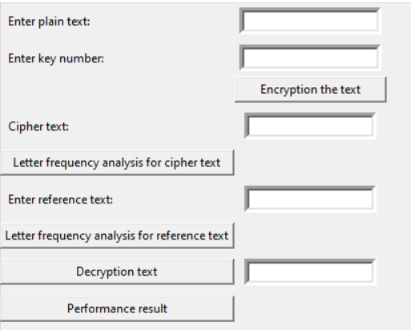
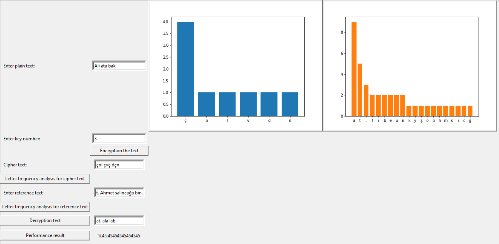

# CAESAR CIPHER

## REQUIREMENTS

* **Python version:  3.9.13**

```python
# Run command on the project location for installation of all libraries
pip install -r requirements.txt
```

## USAGE

1. Install Python (3.9.13)
2. Install required libraries (you can use requirement.txt file)
3. Enter plain text
4. Enter the key number for the shift
5. Push to button for shown the cipher text (button: Encryption the text)
6. Push to the button for cipher text letter frequency analysis (button: Letter frequency analysis for cipher text)
7. Enter reference text
8. Push to the button for reference text letter frequency analysis (button: Letter frequency analysis for reference text)
9. Push to the button for decryotion (button: Decryption text)
10. Push to the button for performance result (button: Performance result)



