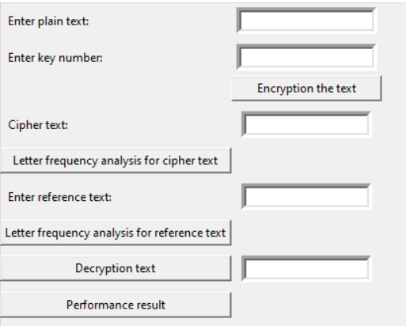
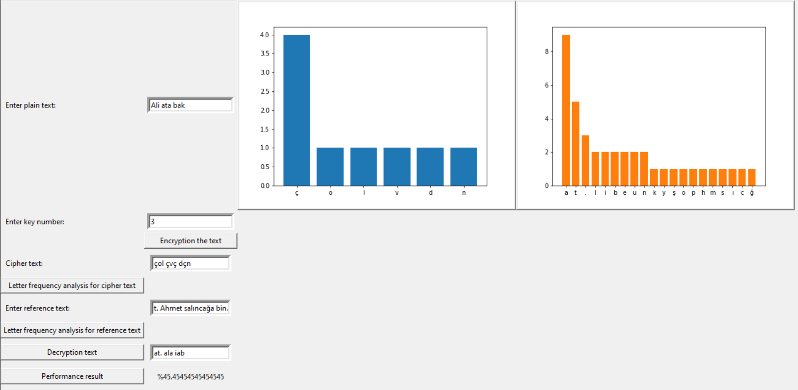

# CAESAR CIPHER

This project is a modern Python implementation of the Caesar Cipher, one of the earliest known encryption techniques in classical cryptography. Beyond basic encryption and decryption capabilities, the application offers advanced text analysis features through an intuitive graphical user interface. The program includes sophisticated cryptanalysis tools such as frequency analysis of encrypted texts and comparison with reference texts, making it an invaluable learning tool for students and enthusiasts interested in understanding encryption algorithms and classical cryptography principles. The application also provides performance metrics to evaluate the effectiveness of different encryption scenarios. Whether used for educational purposes or basic encryption needs, this implementation offers a comprehensive solution that combines historical cryptographic methods with modern analytical capabilities, demonstrating the fundamental concepts of encryption in a practical and accessible way.

## REQUIREMENTS

* **Python version:  3.9.13**

```python
# Run command on the project location for installation of all libraries
pip install -r requirements.txt
```



